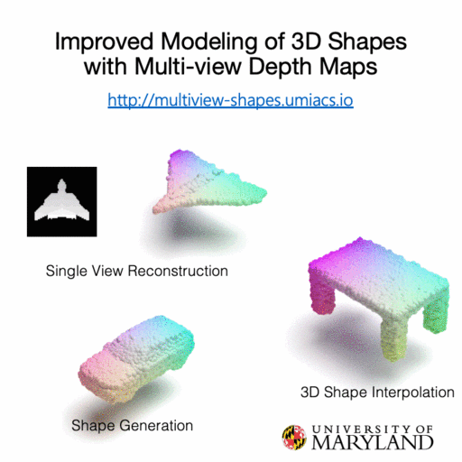

# Improved Modeling of 3D Shapes with Multi-view Depth Maps

PyTorch implementation of [Improved Modeling of 3D Shapes with Multi-view Depth Maps](https://kampta.github.io/multiview-shapes/).
We propose a novel encoder-decoder generative model for 3D shapes using multi-view depth maps; and show applications in single-view reconstruction, shape generation and 3D shape interpolation.
Accepted as an Oral paper in [3DV](http://3dv2020.dgcv.nii.ac.jp).

[arXiv](https://arxiv.org/abs/2009.03298)

[Short Video](https://www.youtube.com/watch?v=dxZfornP_OY)

[Long Video](https://youtu.be/m1nZprFnUu0)





If you use this code in your work, please cite
```
@inproceedings{gupta2020improved,
  title={{Improved Modeling of 3D Shapes with Multi-view Depth Maps}},
  author={Gupta, Kamal and Jabbireddy, Susmija and Shah, Ketul and Shrivastava, Abhinav and Zwicker, Matthias},
  booktitle={International Conference on 3D Vision},
  year={2020},
  url={http://multiview-shapes.umiacs.io},
}
```

## Data preparation
In all our experiments, we use [ShapeNetCore](https://www.shapenet.org/) (v2) dataset.
You'll need to sign an agreement to access and download the dataset on the linked webpage.

Refer to [dataset/README.md](dataset/README.md) for details on data generation.

## Training

Then model training is done in two steps. In the first step, we train an encoder-decoder architecture which takes
a depthmap as input to encoder. The latent representation learned by encoder is used by view-conditioned generator which
generates depthmap from any given viewpoint.
Note that stylegan2 generator model is borrowed from [this repo](https://github.com/rosinality/stylegan2-pytorch).

In the second step, we train an Implicit Maximum Likelihood Expectation (IMLE) model on top of the latent codes learned
in the first step.

### Training the encoder-decoder framework
```
python train_ae_avg.py /path/to/data \
    --ckpt_save_directory /path/to/output/model/checkpoints \
    --sample_save_directory /path/to/output/samples \
    --wandb --no_noise \
    --categories airplane \
    --d_reg_every 0 --g_reg_every 0 \
    --iter 75001 --batch 24 --num_vps 2 \
    --loader_type blender --load_sil --lr 0.004 \
    --channel_multiplier 1 --bins 256 --size 64 --val_batch 8 \
    --use_pretrained_if_available \
    --exp_name airplane_blender_base_avg_cm1_bins_256_size_64
```
### Training the IMLE
Dump the latent codes of the model learned in the previous step and train IMLE as following

```
python train_imle.py
```

## Evaluation
We have borrowed the code for computing CD and CMD from [this repo](https://github.com/zekunhao1995/pcgan-pytorch/).
Please refer to the link on how to compile the code.
For computing Chamfer Distance (CD): 
```
python evaluate_recon_cd.py \
    --gt_pts_path /path/to/groundtruth/pointclouds \
    --gen_pts_path /path/to/reconstructed/pointclouds
```

For computing Earth Mover Distance (EMD):  
```
python evaluate_recon_emd.py \
    --gt_pts_path /path/to/groundtruth/pointclouds \
    --gen_pts_path /path/to/reconstructed/pointclouds
```


## License

MIT
